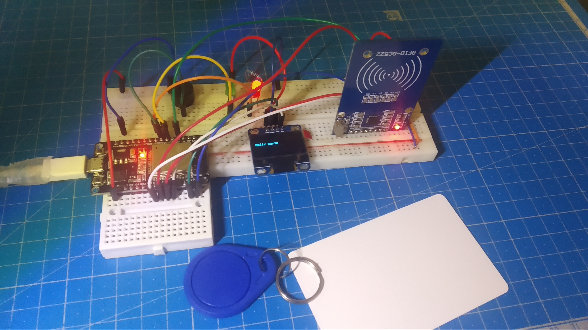

# RfidDatabase
Design of rfid reader that allows you to control access from the database.

## Table of Contents
* [Technologies And Devices Used](#technologies-and-devices-used)
* [Diagram](#diagram)
* [Setup](#setup)
* [Project Status](#project-status)
<!--
[Images](#images)
[Presentation](#presentation)
[Acknowledgements](#acknowledgements)
[Usage](#usage) 
-->

<!--
## Images

-->

## Technologies And Devices Used
- C++
- PHP
- MySQL
- Visual Studio Code with PlatformIO
- Arduino Framework
- ESP32
- RFID MF RC522
- SSD1309 oled display 128x64

## Diagram

## Setup
To start the application you need to have installed a Visual Studio Code and PlatformIO IDE extension.
Open project in VS code.
In file platformio.ini you can change the microcontroller to your own.
In file config.txt you can change pins and serwer settings.
You copy the php files from the phpScripts folder to the server folder and change the username, password and database name in them.
When connected esp32 or esp8266, you can upload program by pressing click upload on blue bottom bar.

<!-- ## Usage -->

<!--
## Presentation
-->

## Project Status
Project is: in progress.

<!-- ## Acknowledgements -->

